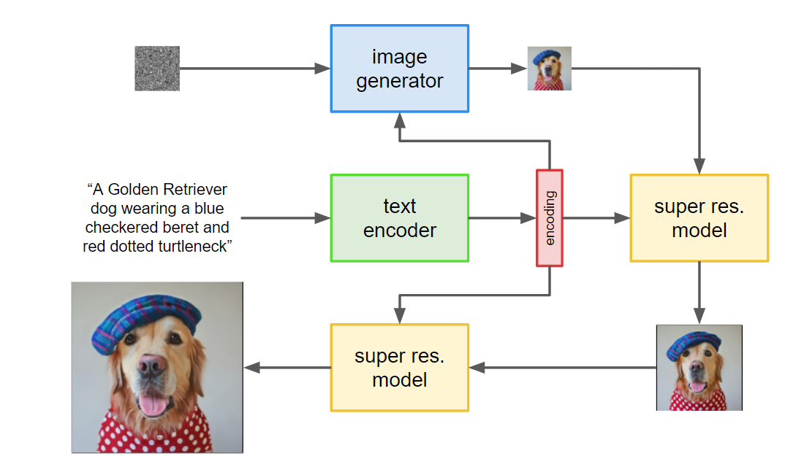
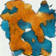
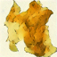

# Project Report: Test 2 Image Generating Task 🎨🖼️




## Introduction

In this project, we aim to implement an **Image Generation** model based on the [**MinImagen**][1](https://github.com/AssemblyAI-Examples/MinImagen) architecture. MinImagen is a text-to-image generation model that is efficient and generates high-quality images from textual descriptions. Our goal is to experiment with this model and share our findings and experiences.

## Implementation

We began by implementing the **MinImagen** model using the resources provided by **AssemblyAI** [2]. The key component of this implementation is the **Diffusion** part, which has the following characteristics compared with the **GigaGAN** in our training environment.:

- Training is fast ⚡
- Sample image generation is slow 🐢
- Convergence is fast 🏃
- Generated results are more meaningful 🎯

<!-- Another important feature of our implementation is the **classifier-free guidance** for text conditioning. This means that we don't need to rely on a separate classifier to guide the image generation process. -->

### Dataset

We used the [**HuggingFace lambdalabs/pokemon-blip-captions dataset**](https://huggingface.co/datasets/lambdalabs/pokemon-blip-captions)🐾 as the basis for our image generation task. We edited the dataloader and dataset functions to make them compatible with our implementation.


### Experimentation

During the experimentation phase, we encountered some challenges:

1. **Model Size**: The original model with super resolution was too large to fit into a 12GB GPU for training, even with a batch size of 1.
2. **Logging**: We used **Weights & Biases (wandb)** for logging our training process.


3. **Remove Super Resolution**: Due to the model's large size, we had to remove the super resolution layer for training.

```json
// Training parameters
{
    "text_embed_dim": null,
    "channels": 3,
    "timesteps": 1000,
    "cond_drop_prob": 0.15,
    "loss_type": "l2",
    "lowres_sample_noise_level": 0.2,
    "auto_normalize_img": true,
    "dynamic_thresholding_percentile": 0.9,
    "only_train_unet_number": null,
    "image_sizes": [
        64
    ],
    "text_encoder_name": "t5_small"
}
// Model Size
{
    "dim": 128,
    "dim_mults": [
        1,
        2,
        4
    ],
    "channels": 3,
    "channels_out": null,
    "cond_dim": null,
    "text_embed_dim": 512,
    "num_resnet_blocks": 1,
    "layer_attns": [
        false,
        true,
        true
    ],
    "layer_cross_attns": [
        false,
        true,
        true
    ],
    "attn_heads": 8,
    "lowres_cond": false,
    "memory_efficient": false,
    "attend_at_middle": false
}
```

Despite these challenges, our model was able to converge quickly, taking only 300 epochs with a batch size of 2 and a time step of 1000 to generate meaningful images. 🌟

| Training Step | Image |
|:-------------:|:-----:|
| a blue and red pokemon 500        |  |
| a blue and red pokemon 600        |  |
| a blue and red pokemon 700        |  |
| a blue and red pokemon 800        |  |

We think the quality of Imagen generated image is better than our previous results from GigaGAN, even in a very early training stage. One could think these images look more complete than the previous results, thus some extent more like a Pokemon.


| Text Prompt (text scale) | Image |
|:-------------:|:-----:|
| a drawing of a green pokemon with red eyes (0.1)        |  |
| a drawing of a green pokemon with red eyes (3.0)       |  |
| a drawing of a green pokemon with red eyes (5.0)       |  |

We could notice that with add more strength to the text scale, it starts to align with the text in some extent. Like when it is 0.1, it is just green. When add to 3.0, it shows a color (<span style="color:yellow">yellow</span> = <span style="color:blue">blue</span> + <span style="color:red">red</span>). When add to 5.0, it shows a blend with yellow and green, thus we assume it catchs more information from the content step by step.


<!-- <span style="color:blue">some *blue* text</span>. -->

## Future Work 💡

We plan to add a **super resolution layer** in the future to further improve our image generation capabilities.

## Conclusion

Our project on implementing and experimenting with the MinImagen architecture for text-to-image generation has been successful. We were able to generate meaningful images from textual descriptions, overcoming challenges related to model size and training resources. We hope that our experience and findings can help others working on similar projects. 😃

[1]: MinImagen: Build Your Own Imagen Text-to-Image Model (https://www.assemblyai.com/blog/minimagen-build-your-own-imagen-text-to-image-model/)
[2]: AssemblyAI-Examples/MinImagen GitHub Repository (https://github.com/AssemblyAI-Examples/MinImagen?ref=assemblyai.com)
